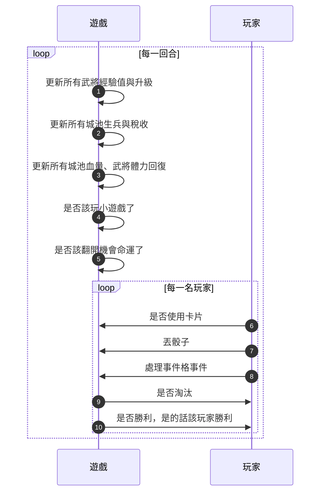
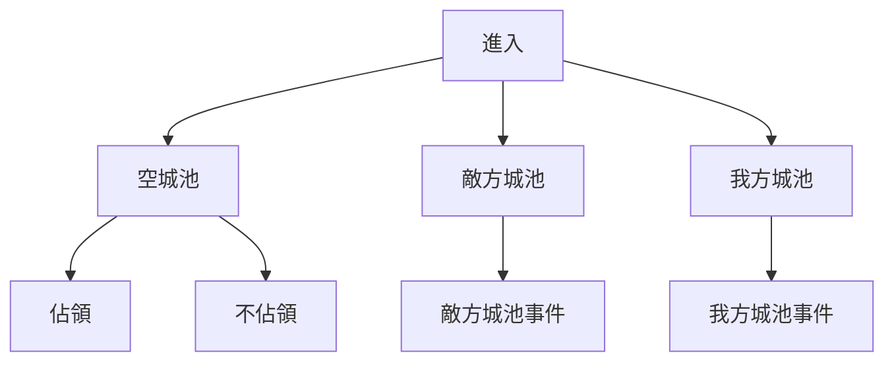
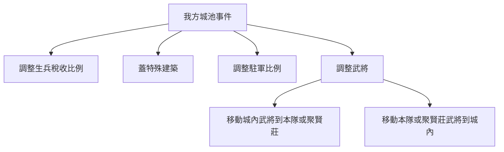
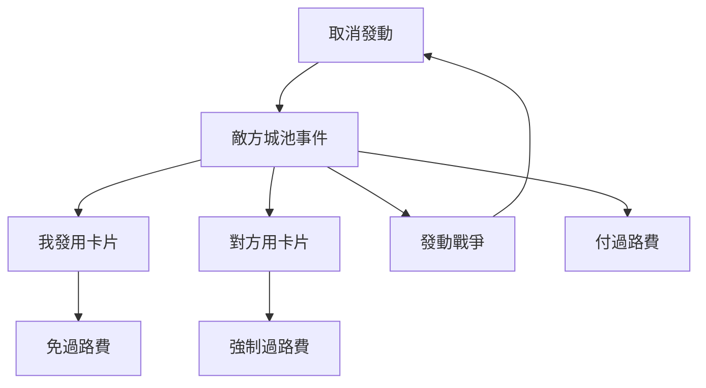
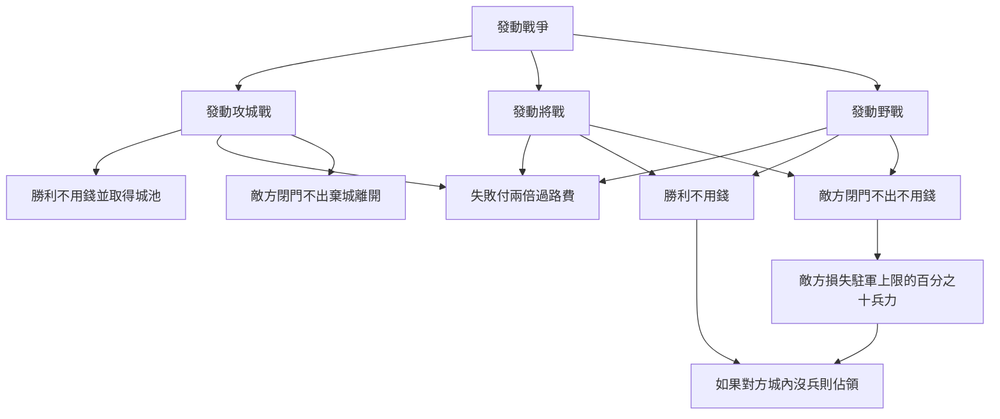
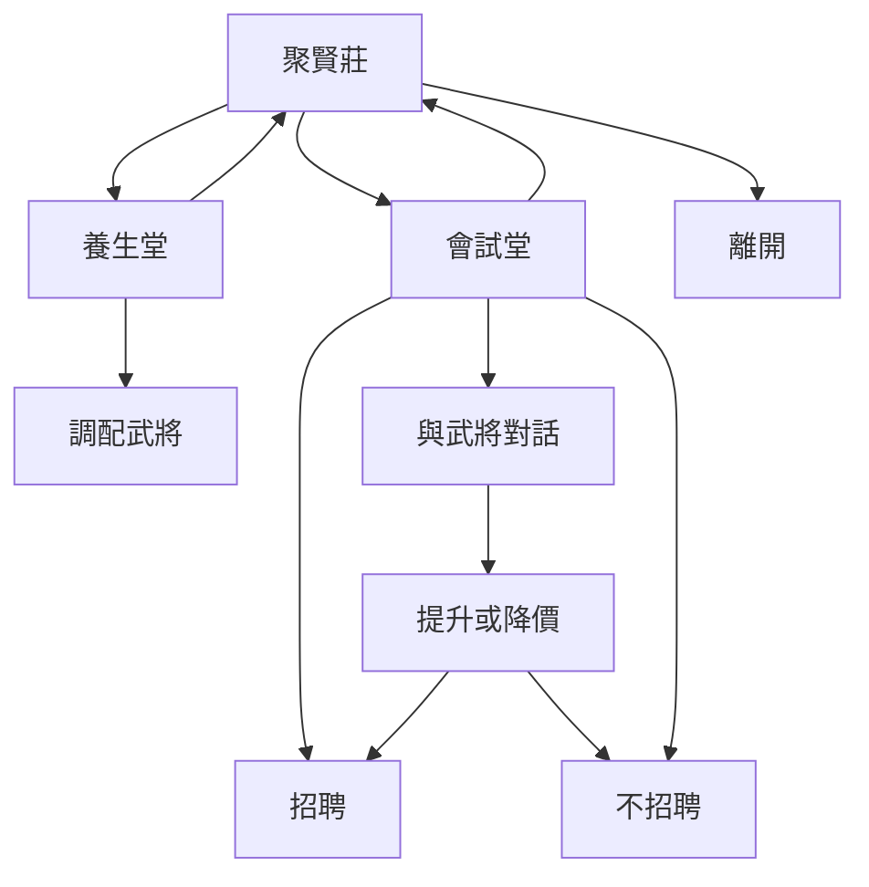

# 富J天下
# 基本資料 (Profile)
遊戲類型: 桌遊遊戲
遊戲模式: 大富翁 + 養成RPG遊戲
玩家人數: 合作對戰(2~4)
目標玩家: 6～40歲，喜歡派對遊戲互動的玩家
目標平台: 電腦平台(PC)

# 設計核心 (Core Value)
## 大富翁玩法
* 會有事件或建築物可以加錢或扣錢
* 每回合走到各種格子有不同的作用
* 走到空的城池就可以佔領
* 走到別人的城池可以付過路費或戰鬥攻取別人的城池
* 每個主公或武將都有自己的特殊能力
## 遊戲流程

### 勝利條件
- 建築勝利 : 場上會有當世奇觀建築 升級三次就贏得勝利
- 城池勝利 : 城池佔有80%就贏得勝利
- 金錢勝利 : 金錢到達50000就贏得勝利
- 聲望勝利 : 聲望達標就贏得勝利
### 主公血量歸零
- 要避避風頭：不能操作3回合

## 主公特性
|主公|主公特性|
|-|-|
曹操      經過敵人身邊偷走卡片
司馬懿    經過敵人身邊減少敵人金錢
董卓      初始武將體力比較高
呂布      初始武將武力比較高
祝融夫人  身邊武將體力恢復速度較快
諸葛亮    初始武將智力比較高
趙雲      在敵方城池資源可少繳過路費
劉備      每回合增加少許士兵
黃月英     每回合得到少許金錢
龍翠公主   買東西可以打折
孫權      身邊武將經驗值成長+30%
周瑜      每五回合獲得一張卡片
魯肅      經過敵人身邊偷走金錢
劉表      在皇宮領的俸祿較多
張角      經過敵人身邊偷走士兵

### 主公技能
- 有冷卻時間
- 在大地圖使用
- ex. 張角可以打雷，造成指定玩家本隊士兵減少10%

### 聲望
- 每個玩家都有起始聲望 100
- 閉門不出 -5
- 打敗仗 -10
- 打勝仗 +10

## 武將養成

本遊戲的武將可以待在三個位置，
分別是本隊、各城池、聚賢莊
本隊身上最多七隻武將、其它備用武將都會在聚賢莊

每個武將有自己的成長曲線與經驗需求，
根據歷史來做出低等強勢或高等強勢的武將。
武將升級後會全屬性提高。

- 統帥 : 打野戰用
- 武力 : 將戰用
- 智力 : 攻城用
- 體力 : 戰鬥時的體力
### 起始武將參考
https://forum.gamer.com.tw/C.php?bsn=2422&snA=1274

### 武將特殊能力
命硬：戰鬥失敗進入負傷狀態不會陣亡
經營：在城池當太守時提升該城池10%的稅收
破城：攻城時對城門傷害增加50%
行軍：走路+50%速度
遠矢：兩倍射程
堅甲：減少小兵30%傷害
療兵：攻城後士兵減少數量減少30%
聰穎：使用卡片時消耗體力減半

## 卡片系統
共有三種卡片：大地圖、野戰、攻城戰
每一種卡片最多可以帶8張

### 大地圖卡片
- 在大地圖可以主動或是被動發動的卡片
ex.
止步草：下一回合原地停留一回合
霸王路：經過城池發動後不戰鬥也能不付過路費
退兵旗：在敵方發動攻城戰時可以發動，發動後敵方無法進攻，並需要繳交一倍過路費。
迷魂陣：傳送指定敵方主公到我方指定位置。
溢軍術：直接增加當前士兵10%。
護神兵：指定武將隨機獲得一件武器。
金剛倒：降低敵人景觀建築等級。

### 野戰卡片
滅敵卡：減少敵方每列一個兵
轉弓卡：轉變我方一列士兵為弓兵
轉騎卡：轉變我方一列士兵為騎兵
轉步卡：轉變我方一列士兵為步兵
敵轉弓：轉變敵方一列士兵為弓兵
敵轉騎：轉變敵方一列士兵為騎兵
敵轉步：轉變敵方一列士兵為步兵

### 攻城戰卡片
烽火台：隨機增加2000~2500友軍

## 格子系統(大地圖)
玩家每回合會擲骰子1~6走到不同的格式可以做不同的事
每個事件格裡的角色會有搞笑無厘頭的對白。
下面介紹所有的格子

### 格子：行宮(佔用1格)
- 預計3秒結束
皇帝的居住地，經過可以獲得所擁有武將數乘100的金錢。

### 格子：城池(佔用3/4/5格，佔比50%)
- 每次路過升級查看預計30秒
- 每座城池的人口起始數量不同，人口每回合成長數量也不同
- 城池有大中小之分，影響攻城戰時城門的體力
- 鄰近的城地如果是同一個主公，每一座城池能給40%的稅收與生兵加成

||小城池 |中城池 |大城池 |
|--|--|--|--|
|起始人口|10000|30000|50000|
|每回合成長人口|10~30|30~90|50~150|
|特殊建築數量|1|2|3|
|城門血量|500|1000|2000|
|佔地格數|3|4|5|

- 城門每回合會回復10%體力
- 武將在城池內每回合會回復50%體力
- 城池依大小可以蓋最多三個特殊建築物
- 第一次佔領時是不能蓋特殊建築的，第二次走到自己的城池就可以消耗金錢與士兵蓋特殊建築，蓋了之後建築設計圖會消失需要再買，但每回合限制蓋一座
- 每座城池有駐守士兵上限，駐兵上限為人口的五分之一
- 選擇要生兵或稅收，每回合結算可以賺到稅收或士兵。
    - 比例只能選2種全部生兵或全部稅收
    - 人口愈多生兵稅收愈高
    - 太守智力愈高稅收愈高
    - 太守武力愈高生兵愈多
    - 稅收公式： `(人口/100)*(1+智力*0.03)`
    - 生兵公式： `(人口/100)*(1+武力*0.03)`
    - 如果士兵超過上限會增加本隊的士兵
- 可以調配駐守的士兵數量，選擇是帶在身上還是放進城裡
- 可以調配駐守的武將，選擇是帶在身上還是放進城裡
    - 可以調配在聚賢莊、本隊的武將來守城
    - 可以把城內的武將移出加入本隊或聚賢莊
- 一座城至少要指定1名太守與0~2名武將守城
- 太守每回合可以增加經驗值 10 點
- 守將每回合可以增加經驗值 5 點
- 如果是空城池可以選擇佔領
    - 佔領至少要有一位太守與100名士兵
- 如果因為機會、命運、主公特殊技造成士兵變成0的話會喪失城池
- 被佔領後城池內的特殊建築可以被拆或保留
- 因意外喪失的城池保留所有特殊建築

### 特殊建築：奇觀建築

在富J天下改成每次經過消耗大量金錢與士兵可以升級，升級3次後即可贏得遊戲。
不會降級、不可攻擊、不可佔領，
一張地圖會有四個奇觀建築，
每個玩家都有屬於自己的一座奇觀建築。
升級奇觀建築所有武將獲得20點經驗。
佔用2格特殊建築格。

|所需要的資源|金錢|士兵|
|-|-|-|
|1|10000|3000|
|2|15000|6000|
|3|20000|10000|

城池的互動

踩到敵方城池

請參考[#戰鬥系統](#戰鬥系統)

### 格子：聚賢莊(佔用1格，佔比10%)

#### 會試堂
可以錢召募武將的地方

對每個武將可以選擇 大罵嫌貴、溫柔攻勢、假裝不屑、苦苦哀求 來對話
召募前可以跟武將對話一次，有機率提升或降低召募的費用

* 由於與三國歷史相結合，不同主公購買同一武將的錢數可能不同，如劉備購買諸葛亮的價格要遠低於曹操購買諸葛亮。

#### 養生堂

可以重新配置本隊與聚賢莊的武將。
如果體力沒滿的武將進入聚賢莊會直接回復滿體力。

### 格子：武道館(佔用1格，佔比10%)
強化介面參考

強化完成參考

這邊可以花錢強化武將的武力，不管是在本隊、城池、聚賢莊的武將都可以強化。
一次最多強化4隻武將，下面是每種課程1隻武將的價錢，每次經過最多強化一次。

|課程    |價錢 | 武力增加 | 體力增加 |
|-------|---- |--------|--------|
|打魔獸  |1100 |0|2~6|
|阿魯巴  |2500 |2~6|2~6|
|練街舞  |1100 |1~5|0|
|國標舞  |550  |0|1~3|
|跳八家將|850  |0|1~5|
|洗馬車  |3250  |4~7|4~7|
|賞櫻花  |1250  |1~3|1~3|
|仰臥起坐|700   |1~3|0|

### 格子：醫館(佔用1格，佔比10%)

這邊會列出我方所有受傷武將與
本場遊戲所有戰鬥失敗體力歸零的重傷武將，
使用還魂香可以用錢醫治自己的武將歸為己用。

- 鐵打酒 醫治一名我方武將 100 元
- 還魂香 醫治一名重傷武將 3000 元

### 格子：募兵處(佔用1格，佔比10%)

募兵結果參考

每次隨機一種能力，依武將能力愈高能募到的兵愈多
一隻兵花1塊錢，最多使用三隻武將募兵
募兵的武將增加20點經驗

### 格子：神兵舖(佔用1格，佔比10%)

可以將任一位置的一位我方武將裝備武器
在富J天下，一個武將只能裝備一個武器
可以轉蛋武器，從1~4階機率出武器，加入保底，
每轉10次就一定會出4階武器。
就會取代原武器，原武器消失。
武器可以裝備給所有位置的武將，但只能在買武器時裝備。
武器可以增加體力與武力。

## 定期事件系統
### 定期事件：卡片商店
介面參考
特別厲害的卡只會出一張，其它都普卡

這邊可以買卡片
### 定期事件：財神賭場
- 觸發後全場參加，各種可以用自己錢賺更多錢的小遊戲
- 賽馬: 八匹馬猜哪匹馬會跑贏，最少壓100，最多壓1000，贏了賺8倍。[參考影片](https://youtu.be/Npxw4Y7w9RE)
- 骰子猜大小: 照原本富甲天下的玩法，骰子改成3個比大小，每次隨機2~18其中一個數字，賭比這個數字大或小。
- 火燒船: 不用錢，鬼腳圖玩法，燒到船有獎金500，燒到空氣什麼都沒有。
- 翻鬼牌: 地上的格子都可以翻開，可以拿到不等的錢。有一個最大獎是卡片或武器，還有很多鬼牌，翻到就出局東西都拿不走，但可以隨時出去把已經贏到的獎品帶走。

### 定期事件：小遊戲
各種簡單的小遊戲，大家自己做自己的事，最後比分數
小遊戲的獎賞應該要能增加遊戲的節奏，讓玩家覺得不是完全靠賽
- 過關斬將: 大家都從最左邊走到右邊，如果走到死路就輸了，玩法就像影片這樣，可以控制閘道，比走到終點的速度 [參考影片](https://www.4gamers.com.tw/news/detail/42450/vietnamese-developers-made-a-games-with-facebook-advertising-gameplay)
- 過關斬將2: 走過一堆加減乘除二選一的路之後，關羽能不能打贏王就看玩家的選擇了，比誰走的最快，且能打贏王 [參考影片](https://www.youtube.com/watch?v=kZixUHyGPvg&ab_channel=%E5%B0%8F%E6%81%A9)
- 過關斬將3: 關羽必需快速下樓去救走劉備，比誰最快到一樓。 [參考影片](https://youtu.be/uP7mvQQjV20?t=374)
- 轅門射戟: 像射擊遊戲一樣，一直射比誰射的分數最多 [參考影片](https://youtu.be/uP7mvQQjV20?t=641)
- 三足鼎立: 玩家按住A鍵伸出長槍，要正確的長度才能穿越地形，比誰走的最遠。 [參考影片](https://www.youtube.com/watch?v=MIxayJB89ic&ab_channel=HyperKid)
- 過關斬將4: 關羽必需先擊敗數字比他小的敵人一步一步到達終點，比誰最快到終點。 [參考影片](https://youtu.be/lRkOzLOK4D0?t=130)
- 丟饅頭:玩家控制力道還有方向讓饅頭落在指定位置  像[憤怒小鳥參考影片](https://youtu.be/eYlH4CLmseY)
- 顏良計數:一群武將跟一群顏良跑過去，關羽最後面一直砍 [參考影片](https://youtu.be/3gCeF0pU2zs?t=709)
    - 關羽砍了幾個顏良
    - 幾個顏良活著
    - 總共出現幾隻顏良
    - 關羽砍了幾個不是顏良的人
- 御前刀工對決:有個神祕的男子出現要來挑戰刀工，依照他的指示切3個方向的刀法，[參考影片](https://youtu.be/Qpjyn7jUpEA?t=2368)
- 草船借箭:玩家變成草船，讓對面一直射箭，看誰可以接到最多，中間會有火箭，被打到2次就淘汰。[參考影片](https://youtu.be/DsUIjYvwYwk)
- 織草鞋:開局劉備給大家展示幾雙鞋子，有不同顏色跟形狀，玩家要去找材料做出來，玩法像overcooked。[參考影片](https://youtu.be/0ZK7veYPEJQ)
- 木牛流馬、懸崖勒馬:按右鍵加速，到最底的時候按左鍵停下來，把主公甩出去最遠的贏。[參考影片](https://youtu.be/XqNrmtxKZNI?t=343)
- 七擒孟獲:類似打地鼠，孟獲會從畫面中4x4 16個草叢中出現，總共7次。看誰抓到最多次   會出現其他角色干擾。[參考影片](https://youtu.be/z_AlQo4b1KA)
- 劍無虛發:神秘的黑衣人會在前面揮舞雙劍，玩家看完一次之後要複製他的動作按上下左右鍵，類似勁舞團學跳舞或魔獸模仿前面的小遊戲。[參考影片](https://www.youtube.com/watch?v=jqjEdDqdIvc)
- 乘虛而入:大家要偷偷潛入糧倉，按A鍵拿糧食，可以按左右走路，然後士兵轉頭巡邏的時候按B鍵躲藏，最後看誰能拿出來的最多，遊戲限時60秒，躲藏的時候捏他潛龍諜影躲在箱子裡。[參考影片](https://youtu.be/_DNHym5bKRM?t=37)
- 探囊取物 2V2:場上一堆小兵，大家都是小兵的模樣，但是有2個人要把東西都偷走，2個人是防守方，防守方只有兩次抓人機會。[參考影片](https://youtu.be/0DXSFfVPZMk)
- 身在曹營心在漢:場上一堆小兵，大家都是小兵的模樣，要找到彼此互砍，一人有3刀，砍一刀後CD1秒，30秒時出口會打開，60秒時遊戲結束，砍到小兵+1，砍到其它人+2，逃出來+5，分數最高的人贏。[參考影片](https://youtu.be/4CCo7qIM4Rw?t=555)
- 牆築高台 2V2: 一個人負責選形狀，另一個人負責安裝。
  像俄羅斯方塊那樣看誰最多完整的一橫排or城牆破爛，然後要選對應的形狀塞進去塞的最滿的那隊贏。[參考影片](https://play.google.com/store/apps/details?id=block.puzzle.blockpuzzle.tetris&hl=zh_TW&gl=US)
- 錦囊妙計 2V2: 其中一個人會得到一個錦囊裡面有寫要什麼圖案，另一個人快速把圖案排出來，誰先排出來誰就贏了 [參考](https://youtu.be/9MKt3o0S6h8?t=540)
- 火燒連環船 2V2: 2個人分別站在2艘船，一個人負責舉盾防守，防守的人可以蹲下或站起來舉盾，另一個射火箭。如果隊友沒蹲下就射，射火箭2箭會把隊友射死，敵方的船要3箭才會起火。
- 三英戰呂布: 1個人是呂布，另外三個會躲起來偷襲呂布 可能上下左右 或九宮格 被呂布砍到就出局 攻擊到呂布指定次數就贏了

### 機會與命運 
每5回合會每隻角色抽一個事件
- 隨機獲得或減少一張卡片
- 隨機獲得或減少金錢
- 隨機獲得或減少士兵
- 隨機升格或降階城池

## 戰鬥系統
進入戰鬥的情況請參考[#格子：城地](#格子：城池)
可以使用本隊身上最多七隻武將作為戰鬥使用
如果有多的武將不在身上也沒在守城
也可以使用主公戰鬥
如果路過方輸了戰鬥又沒足夠的錢付過路費，則本隊武將會隨機離開一隻。
每次戰鬥，戰勝並存活的武將獲得100點經驗，
戰勝並逃亡的武將獲得60點經驗，
戰敗武將獲得50點經驗，
陣亡武將不獲得經驗。
每次戰鬥完後，如果金錢不夠付過路費或是單挑費時，
本隊隨機離開一名武將，如果全部離開即出局。
- 其它玩家可以下賭誰贏誰輸，贏了固定得到2倍金錢，由系統出錢。

### 戰敗後體力歸零的武將
體力歸零會有兩種狀態
- 負傷的武將會進入5回合不能使用的狀態，可以使用卡片加速回歸
- 陣亡的武將會進醫館等待花錢救治

### 雙方踩到同一格
強迫將戰 or 野戰。兩個相遇的玩家決定戰鬥方式，若不一樣則用骰子隨機決定。
贏家拿走輸家3000元
### 對方踩到己方城池的行為選擇
路過方的選擇
- 付過路費，如果錢不夠則不能選取此選項
- 野戰
- 將戰
- 攻城戰
地主方
- 閉門不出：20%的士兵投降對方、收不到過路費。
- 迎戰：
    - 打贏：收兩倍過路費
    - 打輸：收不到過路費，若是輸掉攻城戰則會丟失城池
    - 時間到沒勝負就會平手，付原價過路費。
- 任何戰鬥開打之後都不能取消。
- 戰鬥後體力沒歸零的武將會有經驗值

#### 野戰
- 主要由小兵數量影響強度
- 武將統帥會影響可以帶的小兵數量
- 野戰卡片 買了就能用
- 武將綁定自己的兵種
- 可派最多2名武將戰鬥
- 打輸的一方，體力減30
- 武將像自走棋一樣，氣條滿了就放技能
- 雜魚武將就用通用的雜魚技能 ex. 戰吼
- 名將要有自己特色的技能 ex. 司馬星落、關羽流星趕月
- 統率就是攻擊力

##### 作戰兵種
- 騎兵
- 弓兵
- 長槍兵

#### 攻城戰
- 攻城的部份同野戰
- 帶兵看三圍也有上限，但可能是野戰的n倍
- 攻擊力看武力，不看當前兵量
- 只要三個城門破就算輸了，就算對方還有武將存活也一樣

#### 將戰
- 只能派一名武將戰鬥
- 每名武將都有奧義，奧義會有符合該武將歷史的效果但不一定會有傷害
- 每回合都必需指定動作
- 武將的基礎傷害為`武力*0.1`
- 如果戰鬥後血量少於10%武將會自動逃跑，
  如果敵方攻擊力太高，武將來不及逃就會陣亡
##### 奧義
歷史上的名將會有符合自己特色的招式
- 諸葛亮：臥龍光線(連續3個回合攻擊額外造成50%傷害)
- 司馬懿：星落(準備一回合後，敵方暈眩3回合並造成200%傷害)
- 張飛：萬夫莫敵(連續3回合受到傷害減少50%)
- 趙雲：無雙亂舞(連續3回合攻擊一定造成120%傷害)
- 關羽：流星斬月(旋風斬：連續3回合受到傷害減少50%並額外造成30%傷害)
- 魏延：十面埋伏(分身：下一次攻擊造成兩倍傷害)
- 典偉：古之惡來(妖火：三回合內增加敵人受到傷害)
- 劉禪：樂不思蜀(裝死：免疫下次傷害)
- 通用技能：戰吼(連續3個回合增加自己15%傷害)
- 通用技能：穩健(連續3個回合減少受到15%傷害)
- 通用技能：防守(連續3個回合減少受到30%傷害與15%造成傷害)

##### 將戰選擇
- 攻擊
- 重攻擊
- 防守反擊
- 奧義(怒氣值滿可以施放)
- 傷害為武力的倍數
像奕仙牌那樣，事先設定好所有動作十張卡，
設定好之後就自己打，打完十回合結束。
怒氣值上限100，起始0
奧義中斷對方行為一回合造成5倍傷害

|行為真值表|攻擊|重攻擊|防守反擊|
|-|-|-|-|
|攻擊|互相受到1倍傷|攻擊方造成1倍傷|防守反擊造成1倍傷|
|重攻擊|攻擊方造成1倍傷|互相受到1倍傷|重攻擊造成1倍傷|
|防守反擊|防守反擊方造成1倍傷|重攻擊造成1倍傷|互相受到1倍傷|

### 配音
主公配音
雜魚配音

